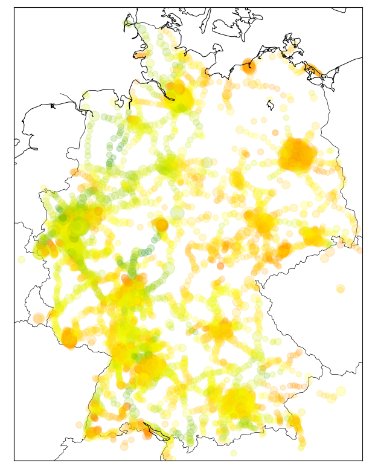

# Analyse
Diagramme zur Datenanalyse in unserer Projektdokumentation für Jugend Forscht 2021

## Datenfehler

## Verspätungen während einer Stunde

## Verspätungen während eines Tags

## Verspätungen während einer Woche

## Datenverfügbarkeit übers Jahr

## Verspätungsverteilung

## Verspätungskarte

## Verspätungen

## Ausfälle

## Packed-Bubbles
Um solche Packed-Bubble Charts zu erstellen, mussten wir unseren eingenen Algorithmus schreiben, da dieser Diagramtyp nicht von Matplotlib unterstützt wird. (Es gibt zwar einen auf Stackoverflow dazu, der ist aber unglaublich langsam und daher nicht für unsere Menge an Bubbles geeignet.) Hier ein GIF dazu, wie unser Algorithmus arbeitet:

## Verspätung in Abhängigkeit der bereits gefahrenen Strecke
